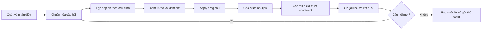

# Kế hoạch nâng cấp chuyên sâu AUTOFILL-KS-NTTU

**Ngày:** 05/10/2026 · **Trạng thái:** kế hoạch kỹ thuật, chưa triển khai các hạng mục bên dưới · **Baseline runtime:** v2.0.0, commit `1a8c9c0c2cded8a23e8567ff9a28aeaf517ea3c2`.

Đầu vào: [nghiên cứu cạnh tranh](COMPETITIVE_RESEARCH.md), [protocol benchmark](BENCHMARK_V3_PROTOCOL.md), [5 probe tái hiện giới hạn](research/2026-10-05/v2-gap-audit.json). Nghiên cứu thu 711 repo duy nhất qua 22 query/27 trang; chọn 25 repo để xác minh, pin được 23, đọc các đoạn source/docs liên quan từ 26 file ở 16 repo. Chưa đo runtime của đối thủ.

## 1. Đích sản phẩm và định nghĩa hoàn tất

Extension giúp người dùng thực hiện **đáp án họ chọn** trên NTTU/HTML, Google Forms và Microsoft Forms, với fixed/random/weighted phù hợp từng loại câu hỏi. Quét → xem trước → điền → xác minh → báo thiếu/lỗi → người dùng gửi. Đáp án không được suy đoán từ số thứ tự của DOM nếu người dùng yêu cầu một ý nghĩa cụ thể.

Đích cạnh tranh là dẫn đầu hoặc đồng dẫn đầu **từng suite/version/roster đã công bố**, trước hết về whole-form exact completion, sau đó tốc độ và thao tác cấu hình. Mục tiêu “mượt 100%” được chuyển thành critical cases đạt 100%, không báo thành công giả, thao tác Stop/Undo rõ ràng và không mất sửa tay. Không có cơ sở để bảo đảm toàn bộ internet hay mọi DOM chưa biết.

Một milestone chỉ hoàn tất khi có implementation, regression phù hợp, gói cài chạy đúng và evidence. Kế hoạch này hoàn tất bước nghiên cứu/lập kế hoạch; không tự đổi nó thành claim v3 đã đạt.

## 2. Những việc phải sửa trước tính năng mới

| Giới hạn đã đo | Sửa ở root cause | Nghiệm thu tối thiểu |
| --- | --- | --- |
| Highest satisfaction chọn N/A | `shared.js`: scale có semantics, option exclusions; không fallback toàn thang khi một nhãn chưa biết | 5 mức + N/A chọn “Rất hài lòng”; random/weighted không chọn N/A khi bị loại |
| Nhãn 7..1 chọn 1 | Tách numeric-score policy khỏi DOM position; scale metadata là nguồn chuẩn | Highest numeric chọn 7, giữ fixed-position đúng vị trí người dùng yêu cầu |
| Combobox đóng scan ra 0 | `content.js`: nhận control trước khi options tồn tại; open/read/choose/commit tách rõ | Preview chỉ ra cần mở; apply mở đúng popup, chọn đúng option, verify state |
| Seed/rules đổi sau rerender | Logical question key độc lập node handle | Cùng form/seed giữ đáp án qua rerender/reorder; ambiguous identity không đoán |
| `step=any` midpoint ra 1 | Policy số liên tục có precision explicit; decimal discrete tính theo min/step | 0..1 @50% =0,5; min=0,1 step=0,2 không lệch; browser validity đạt |

Các probe đang **assert hành vi giới hạn của v2** để lưu bằng chứng. Khi sửa, chuyển expectation sang kết quả đúng trong regression suite; không tiếp tục giữ “bug còn xảy ra” như tiêu chí passing của release.

## 3. Mô hình câu hỏi và chính sách lựa chọn

### 3.1 Dữ liệu tối thiểu cần bổ sung

Giữ `shared.js` cho chính sách thuần và tận dụng `content.js`/loader hiện tại. Không viết lại UI bằng framework hoặc dựng plugin system. Khi triển khai adapters thật cho ba nền tảng, chỉ tách code theo các trách nhiệm có **nhiều implementation thực tế**.

Một question descriptor cần: logical key, platform/form/section/row key, loại, title/helpText, option keys/labels/values, scale semantics, required/constraints, answered state, capability status, verification method. Node refs giữ ở content context, không gửi qua storage hoặc JSON.

Các trạng thái field: `ready`, `needs-options`, `needs-user`, `unsupported`, `blocked-permission`. Trạng thái job: `previewed`, `running`, `waiting-dom`, `paused`, `completed`, `cancelled`, `failed`. `completed` chỉ nói tác vụ kết thúc; cần số correct/failed/remaining riêng, không dùng “thành công” khi chưa đủ yêu cầu.

Logical key ưu tiên ID câu hỏi ổn định của nền tảng; sau đó form/section + native name ổn định + row/column + normalized label/type. Không dùng số lần WeakMap cấp ID làm key PRNG. Nếu hai câu giống hoàn toàn và không có tín hiệu phân biệt ổn định, đánh dấu ambiguous; không hứa seed giữ mapping khi không thể biết câu nào là câu nào.

Options có key riêng; shuffle DOM không làm đổi fixed-label/value hay weight. Fingerprint chứa cấu trúc/policy-relevant constraints; answered-state/user edits so sánh riêng trước apply. Đổi option/constraint làm preview stale, hiển thị diff và yêu cầu preview lại. Pure rerender cùng schema được rebind an toàn thay vì làm mất mọi override.

### 3.2 Quy tắc precedence

1. Trường bị người dùng bảo vệ hoặc policy cấm: skip.
2. Giá trị người dùng vừa sửa/đã có: giữ, trừ overwrite được bật rõ.
3. Override riêng câu và exact rule theo form.
4. Profile value/alias phù hợp loại trường và unique match.
5. Rule nhóm/câu hỏi/loại.
6. Preset nền tảng rồi default chung.
7. Thiếu dữ liệu, ràng buộc vô nghiệm hoặc match mơ hồ: needs-user.

Exact label/value có nhiều candidate thì từ chối. Fuzzy matching chỉ gợi ý mặc định; auto apply chỉ khi unique match, đủ ngưỡng đã hiệu chỉnh trên held-out labelled pairs và cách biệt so với candidate thứ hai. Không chọn ngưỡng 79%/0,45 chỉ vì đối thủ dùng con số đó. Báo precision/coverage theo ngưỡng; tên sinh viên, mã học phần và tên môn không bị tráo vì một token giống nhau.

### 3.3 Feature matrix theo loại

| Loại | Cố định | Random/weighted | Xác minh và giới hạn |
| --- | --- | --- | --- |
| Radio/single choice | Exact label/value; numeric/semantic scale; position explicit | Theo allowed options hoặc weights từng option | Đúng một lựa chọn trong đúng nhóm; preserve prefilled |
| Checkbox/multi-select | Tập exact values; không lấy các ô liền kề theo wrap-around ngầm | Chọn không lặp, min/max count, exclusions, required constraints | Đủ tập mong muốn, không chọn option mutually exclusive cùng option khác |
| Native/custom dropdown | Exact value/label, position nếu người dùng chọn | Chỉ random trên toàn allowed set đã biết | Open/read đúng popup; commit; close; state vẫn đúng sau blur |
| Linear scale/rating | Numeric/semantic target với endpoints explicit | Uniform hoặc weights trên từng mức thực | Scale đảo/0-based/7-level; không hiểu rating bằng thứ tự HTML |
| Radio grid/Likert | Policy từng hàng + cột semantic | Per-row; tôn trọng unique-column constraint | Vector hàng đúng; title hàng không lẫn heading chung |
| Checkbox grid | Tập cột của từng hàng | Cardinality/constraints theo hàng | Matrix đầy đủ; không flatten vào một checkbox group |
| Ranking | Thứ tự exact của item keys | Permutation không trùng; có policy exclude | Full order ở state; drag/keyboard chỉ theo capability đã kiểm |
| Text/paragraph | Giá trị/profile/mẫu người dùng | Random từ các mẫu người dùng đã cung cấp | min/max length, pattern, multiline, validation; không tự tạo ý kiến cá nhân |
| Number/range | Giá trị exact hoặc % của bounds | Discrete step hoặc continuous precision; weighted bins nếu định nghĩa rõ | Min-offset, decimal, negative, validity; không tự giả định bounds cho number |
| Date/time/datetime | Giá trị ISO hoặc locale explicit; composite parts | Khoảng người dùng đặt, cùng timezone đã ghi | Leap day, min/max, AM/PM, local date tránh lệch UTC |
| Other + textbox | Chọn Other khi có nội dung đi kèm | Random Other chỉ khi có template và constraint hợp lệ | Parent option + dependent text cùng task; không tạo required trống |
| Contenteditable | Văn bản plain, rich editor chỉ adapter đã kiểm | Mẫu text như trên | State editor/blur; không chèn HTML từ profile |
| File/CAPTCHA/password/canvas/closed-shadow | Manual/unsupported rõ | Không random điền | Giải thích capability, không tính fake success |

Weighted hiện tại 5 bins phải được nâng thành weights theo option hoặc numeric bins explicit. Migration profile v1 giữ semantics cũ và cảnh báo khi áp vào thang không có nghĩa; không âm thầm đổi đáp án người dùng đã lưu.

Uniform random phân phối trên **eligible set**, không random rồi loại bỏ theo cách làm lệch không được tài liệu hóa. Checkbox lấy mẫu không lặp; ranking là permutation. Với constraint “mỗi cột một lần” phải lập assignment hợp lệ hoặc báo vô nghiệm. PRNG stream = seed + logical question key + policy version; stream cho text/checkbox tách để một loại câu mới không đổi đáp án câu khác.

Không suy luận tự động “câu hỏi phủ định nên đảo điểm”. Negative wording, mức độ hài lòng, tần suất và mức quan trọng là các semantics khác; người dùng xác nhận preset/inversion khi cần.

## 4. Adapters ba nền tảng: phạm vi triển khai cụ thể

### NTTU / HTML / khảo sát trường

Ưu tiên `.group-cautraloi`, native form grouping, row labels, required, bảng thang điểm, controls không name, nhiều môn/học phần và Unicode tiếng Việt. Tách “thông tin học phần” với “đáp án khảo sát” để missing profile không bị thay bằng comment. Rule theo form/host allowlist, không dùng selector substring “nttu” để kết luận tương thích.

Bộ fixture cần DOM đã cho phép từ NTTU và ít nhất hai portal trường khác hoặc bản tự viết có nguồn rõ. Các scripts HUTECH/HCMUS chỉ là tham chiếu bố cục/luồng, không là bằng chứng engine sẽ chạy trên portal của họ. Liên kết danh sách môn có thể hỗ trợ điều hướng thủ công, chưa mở bulk-submit.

### Google Forms

Nhận diện question containers, labels/options, Other, scale endpoints, rating và grid rows bằng quan hệ cấu trúc; dùng data attributes/ARIA trước class obfuscated khi phù hợp. Class fallback phải được version và có fixture. Không đọc private internal API làm hợp đồng ổn định.

Dropdown: preview không click âm thầm nếu đang ở chế độ scan thuần. Người dùng có nút khám phá danh sách nếu cần mở UI; khi áp dụng, open đúng control → locate popup qua aria-controls/ownership → chờ options → exact choose → commit → close → verify. Option portal và dropdown khác có cùng nhãn phải được phân scope. Virtual list chỉ random đầy đủ nếu thu được inventory đáng tin; không gọi random uniform khi chỉ thấy viewport.

Composite date/time/rating cần descriptor chung + subcontrols; grid là nhiều row descriptors liên kết parent. Sections/branch điều khiển theo mục 5. Tối thiểu live-owned forms chứa mọi loại hỗ trợ, không gọi ARIA fixture tự viết là đã kiểm Google hiện tại.

### Microsoft Forms

Nhận diện question item/title, choice/multi-choice/dropdown, rating, Likert, ranking, dates, sections và restrictions. Các domain hiện tại phải được kiểm với URL tài liệu/live thật, không suy ra chỉ từ một hostname string.

Likert rows cần label/scale đúng; ranking cần committed order, ưu tiên tương tác keyboard đã hỗ trợ, nếu site đòi trusted gesture thì chuyển thao tác tay. Không sửa DOM order rồi báo xong. Date locale và required text restrictions đi vào constraints, không chỉ xem HTML `validity` nếu custom validation.

Mỗi adapter có vài hàm discover/apply/readState tương ứng, dùng chung normalizer/policy/wait/report. Chỉ tạo registry ba adapter đang tồn tại; không dựng marketplace hoặc abstraction cho mọi survey vendor giả định.

## 5. Apply/verify, biểu mẫu động và phục hồi

### 5.1 Chờ theo điều kiện, có deadline

Thay “sleep 100 ms là đủ” bằng wait đúng predicate: option xuất hiện, expanded state đổi, selected state commit, required branch ổn định. `MutationObserver` chỉ quan sát root/attributes cần thiết; ngắt hoặc lọc mutation do engine tạo để tránh loop. Không đợi “toàn document yên” vì animation/ad liên tục.

Mỗi wait có AbortSignal, deadline, cleanup observer/timer và lý do timeout. Retry mặc định tối đa 2 lần, chỉ thao tác idempotent hoặc re-check state trước click. Không double-toggle checkbox vì timeout. Report phân biệt not-found, ambiguous, invalid-value, commit-rejected, stale-node, permission và unsupported; không catch rồi tăng filled.

Với framework, native setter + events là đường đầu tiên nhưng phải đọc state sau blur/rerender. [React controlled-input docs](https://react.dev/reference/react-dom/components/input) là lý do fixture cần backing state thật. Synthetic events có `isTrusted=false`; không thể hứa chúng vượt mọi gesture gate. Nếu widget không nhận, manual-assist có hướng dẫn; không tự thêm debugger permission chỉ để bắt chước tool automation rộng.

### 5.2 Điều kiện cùng trang

Sau apply, rescan dirty question roots; diff danh sách câu hỏi và lập plan cho câu mới dưới policy đã xác nhận. Câu hỏi mới cần dữ liệu thiếu thì pause rõ. Không chạy full-document scan sau mỗi click.

Giới hạn dự kiến: tối đa 10 vòng ổn định, 2 retries/câu, deadline job theo config, option/case count giới hạn. Khi branch toggles tạo cycle, ngừng và báo đúng parent gây thay đổi. Không xóa dữ liệu user ở nhánh vừa ẩn; không điền hidden branch.

### 5.3 Nhiều trang

Mặc định chỉ điền trang đang xem. Chế độ “hỗ trợ nhiều trang” lưu session logical form key, số trang và completed field keys; hiển thị câu còn thiếu và nút **Tiếp tục trang sau** để người dùng chủ động cho chuyển trang. Chỉ Next được nhận diện chắc chắn, không nhầm Submit/Complete/Save.

Sau navigation/SPA transition, bind document mới, revalidate platform/schema và preview câu mới. Back/forward không điền lại câu đã committed còn đúng. Không tự gửi khảo sát công khai hoặc tạo nhiều phản hồi để benchmark.

### 5.4 Stop, resume, Undo

Stop hủy wait và ngăn phát hành action mới; report ghi cả action đã gửi nhưng commit còn in-flight. UI acknowledgment phải nhanh, không chờ hết deadline. Rollback không tự chạy vì có thể mất sửa tay.

Journal mỗi field: logical key, before state, planned/committed state, timestamp, adapter/schema version. Undo chỉ restore khi state hiện tại vẫn bằng state engine đã ghi; nếu user sửa sau đó thì skip-conflict. Undo checkbox/grid/ranking theo state vector nguyên tử nếu adapter hỗ trợ; unsupported Undo hiển thị rõ.

Resume gắn tab + **document identity**, không chỉ tabId vì một tab có thể chuyển sang website khác. Worker/panel restart khôi phục config/progress đã ack qua storage.session; dữ liệu cá nhân mặc định ở storage.local theo profile. Reload/full navigation không tiếp tục ghi tự động khi fingerprint/form identity chưa xác nhận lại. Chặn duplicate job ở đúng content document, xử lý lost reply bằng status, không retry cả form mù quáng.

## 6. Giao diện: ba tab lớn và chức năng nhỏ

Giữ **NTTU / HTML**, **Google Forms**, **Microsoft Forms**. Mỗi tab có 4 subtab dùng chung component/logic:

| Subtab | Nội dung | Hành vi có ích |
| --- | --- | --- |
| Chọn đáp án | Fixed label/value/scale, random bounds, per-option weights, type presets | Chỉ hiện controls hợp lệ cho loại; giải thích score vs position |
| Câu hỏi | Filter theo loại/section/trạng thái, preview, override, exclude/protect | Rõ câu needs-user/unsupported, không render 1.000 editor cùng lúc |
| Hồ sơ & quy tắc | Profile môn/người dùng, form-scoped aliases, import/export, remember explicit mapping | Xem diff trước áp profile; local; rule mơ hồ cần xử lý |
| Tiến trình & kiểm tra | Filled verified, failed, remaining, Stop, resume, Undo, log đã redact | Bấm lỗi để focus đúng câu; không dùng tổng filled che sai toàn form |

Common settings giữ riêng với per-platform presets. Người dùng đổi tab không âm thầm thay target URL; hiện tên/host form mục tiêu, trạng thái adapter và số loại hỗ trợ. Cảnh báo stale gắn diff cụ thể, không reset toàn bộ config.

Ở 300 px: bố cục một cột, labels không cắt, focus ring, tab semantics/keyboard, live region tiến trình không spam, thao tác nhanh bằng shortcut đã đăng ký chính thức. Bắt đầu paging 50 câu và filter native; chỉ virtualize khi profiling cho thấy paging không đáp ứng. Không thêm UI library để tạo tab.

Preset “Mức cao nhất” chỉ cho thang recognized; nominal câu như giới tính/khoa phải chọn exact value hoặc random allowed explicit. Text templates có tên/preview nhưng không auto-generated câu trả lời ý kiến. Import schema mới có preview migration và backup local; không ghi đè profile tồn tại chỉ vì ID trùng.

## 7. Hiệu năng và độ ổn định

Đo trước khi tối ưu. Tách scan/normalize/plan/apply/wait/verify/render/IPC để biết timer, DOM layout hay UI gây chậm. Internal 105,8× chủ yếu do bỏ delay v1.5; không dùng nó như chứng cứ CPU hoặc đối thủ chậm.

- Thay full scan mỗi action bằng dirty-root rescan sau khi benchmark chỉ ra chi phí; scan ban đầu theo chunks/time budget để Stop còn chạy.
- Đọc geometry/style theo batch, không xen nhiều read/write gây forced layout. Cache semantic/matching theo schema/policy version; invalidate khi option/constraint đổi.
- Bounded progress payload: counts + row delta, chỉ final report có đủ rows; throttle theo thời gian và trạng thái, không theo 5 câu duy nhất.
- Không giữ detached nodes trong session history; clear root caches/observers khi job/document kết thúc.
- Tối ưu 1.000 câu cần oracle và panel latency cùng lúc. Chấp nhận chậm hơn nếu cần commit verification; không bỏ verify để “thắng ms”.
- Regression perf trên dedicated machine, shared CI chỉ cảnh báo. Budget dự kiến: scan 100 câu p95 ≤150 ms, fill 100 p95 ≤750 ms; 1.000 scan ≤750 ms/fill ≤5 s; Stop ≤100 ms. Cần hiệu chỉnh trước run release, không phải số liệu đã đạt.

Không dùng backend/cache global/worker pool khi bottleneck là DOM main thread. Web Worker chỉ xét cho pure compute nặng đã profile, không chuyển DOM vào worker.

## 8. Quyền truy cập, dữ liệu và phạm vi hỗ trợ

Giữ activeTab + scripting hiện có. Cross-origin iframe là tính năng riêng: extension phải được cấp host phù hợp và inject đúng frame/document; [Chrome scripting API](https://developer.chrome.com/docs/extensions/reference/api/scripting) nêu các target đó. Không mặc định xin mọi host để lấy một con số coverage đẹp. Denied permission được hiển thị là blocked-permission.

Open shadow dùng scan hiện tại; closed shadow/canvas không DOM accessible là unsupported/manual. Không đọc browser password manager, cookie/token/CSRF hay sinh dữ liệu định danh bị thiếu. Report export mặc định thay tên/email/mã sinh viên bằng placeholders; full-data export chỉ bằng thao tác rõ của người dùng.

Validate schema, lengths, ranges, object keys và URLs tại message/import boundary. Không thực thi Javascript/regex không giới hạn từ profile; bắt đầu rules exact/contains/alias có scope, selector advanced chỉ khi cần với lỗi được giải thích. Content title/option/profile luôn render textContent. Không gửi page content tới cloud trong core release; AI nếu sau này có nhu cầu phải là feature riêng có data preview và benchmark/cost riêng.

License đối thủ được ghi trong registry; đọc LICENSE đầy đủ trước build/reuse. Runtime implementation viết riêng theo spec và fixture; không chép source license không rõ để nhanh đạt feature parity.

### 8.1 Kiểm soát mã độc và chuỗi cung ứng

Theo yêu cầu bổ sung của người dùng, nguồn nghiên cứu được giữ dạng `.source.txt`, chỉ đọc, không chạy hay cài gói/binary đối thủ. Cache không được commit và không có trong package allowlist. Windows Defender đã quét thư mục dự án; kết quả và audit dependency lưu tại [security-check.json](research/2026-10-05/security-check.json). Một lần quét không chứng minh sạch tuyệt đối trước mọi mã độc chưa biết.

Khi đến benchmark đối thủ có thực thi: dùng VM/profile thử nghiệm sạch, không tài khoản cá nhân, cookie, SSH/API keys hay thư mục chia sẻ có quyền ghi. Offline track chỉ cần fixture hosts; các network requests khác bị chặn và ghi log. AI/cloud track có môi trường/quyền riêng, chỉ dữ liệu giả. Không chạy install hooks/build scripts của repo lạ trên workstation chính; đọc lockfile/scripts/license trước, pin SHA/hash, kiểm dependency advisories, rồi build trong môi trường dùng một lần.

Delivery chỉ nhận runtime files đã review, CSP MV3 và permission tối thiểu; không remote executable code, không `eval`/`new Function` từ profile/page, không download `.exe`/`.bat` để mở khóa tính năng. Kiểm ZIP extraction path, allowlist, hashes và browser integration; dependency update cần regression và scan lại, không coi chữ “GitHub” hay “Chrome Store” là chứng nhận không mã độc. Những kiểm tra này thuộc B08/B32/B35, không thay độ đúng bằng một điểm security tổng hợp.

## 9. Backlog có phụ thuộc và nghiệm thu

Các ID là đầu việc triển khai, **chưa phải đã tạo GitHub Issues**. “P0” chặn claim độ đúng/release nâng cấp; “P1” để đạt ba nền tảng; “P2” mở rộng sau khi core ổn định. Ước lượng theo phase ở mục 10, tránh giả vờ chính xác từng giờ.

| ID | Ưu tiên | Công việc | Phụ thuộc | Nghiệm thu cụ thể |
| --- | --- | --- | --- | --- |
| B01 | P0 | Freeze baseline, fixture/oracle schema, failure taxonomy | Không | SHA/hash + oracle độc lập + raw result cho mọi case |
| B02 | P0 | Đưa 5 probe vào regressions kết quả đúng | B01 | Test fail trên v2 hiện tại, pass sau fix; không assert bug như success |
| B03 | P0 | Scale semantics/N/A/numeric reverse | B02 | 3/5/7/10, đảo chiều, unknown/NA, nominal đều chọn/abstain đúng |
| B04 | P0 | Decimal/min-offset/step-any policy | B02 | Negative bounds, fractional min/step/any, invalid range và browser validity |
| B05 | P0 | Logical question/option keys + PRNG streams | B01 | Seed/override giữ qua rerender/reorder; duplicate ambiguous không tráo |
| B06 | P0 | Shared closed-combobox open/read/choose | B02 | Một popup đúng scope; lazy/portal/duplicate labels; timeout không fake success |
| B07 | P0 | Apply+commit verification và abortable wait | B05,B06 | Rejected writes/rerenders/custom validity báo lỗi; idempotent retries |
| B08 | P0 | Validate message/import, stale diff, protected fields | B01,B05 | Bad schema/prototype keys/huge values/unknown origin bị từ chối rõ |
| B09 | P1 | NTTU/native adapter với matrix/profile | B03,B05,B07 | NTTU family toàn đúng; names nhiều forms riêng; profile môn không lẫn |
| B10 | P1 | Google choice/checkbox/Other | B05,B07 | Cardinality, exclusive options, Other+text đúng và required đạt |
| B11 | P1 | Google dropdown/portal/virtual options | B06,B07 | Không chọn nhầm popup; random không giả full inventory |
| B12 | P1 | Google radio/checkbox grid | B03,B10 | Oracle matrix + unique-column constraint; labels hàng đúng |
| B13 | P1 | Google rating/date/time/validation | B04,B07 | Composite value/locale/AMPM/leap day đúng; invalid không counted |
| B14 | P1 | Microsoft choice/dropdown/restrictions | B06,B07 | Single/multi choice và custom validation đúng |
| B15 | P1 | Microsoft Likert | B03,B14 | Mỗi hàng đúng semantic target, matrix required đủ |
| B16 | P1 | Microsoft ranking | B05,B07,B14 | Exact/permutation order đúng state; unsupported gesture không giả thành công |
| B17 | P1 | Microsoft date/rating/text composites | B04,B14 | Locale, endpoints, custom validation và sections |
| B18 | P1 | Form rules/aliases, unique-match suggestions | B05,B08 | Exact ưu tiên; held-out precision/coverage; không lẫn code/name |
| B19 | P1 | N-option weights/cardinality/constraints | B03,B04,B05 | 10.000 draws đại diện, 0 weight never selected, impossible constraints abstain |
| B20 | P1 | Per-type/per-group presets + migration v1 | B18,B19 | Profile cũ roundtrip; preview migration; per-question wins precedence |
| B21 | P2 | Same-page branch stabilization | B07,B10,B14 | 3-layer branching, cycles, reveal/hide và missing data pause đúng |
| B22 | P2 | User-assisted sections/Next/Back | B05,B21 | Không click Submit; document rebind; không double-fill khi quay lại |
| B23 | P2 | Profiling + chunk/dirty-root scan | B01,B07 | Budget + oracle cùng đạt; không MutationObserver self-loop |
| B24 | P1 | Real framework/widget fixture apps | B07 | React/Vue/Angular/Svelte backing state qua rerender/blur, không chỉ mock setter |
| B25 | P2 | Optional frame permissions/document routing | B08,B24 | Granted/denied/nested frames; không reply nhầm frame hoặc double group |
| B26 | P1 | Abort/Stop/session recovery/idempotent jobs | B05,B07 | Worker/panel restart và lost reply giữ tiến trình; new document không tự ghi |
| B27 | P1 | Before/after journal + conflict-aware Undo | B07,B26 | User edit sau fill không bị Undo xóa; vector states được restore đúng |
| B28 | P1 | 3 platform tabs × 4 subtabs | B09–B20 | Settings/Câu hỏi/Hồ sơ/Tiến trình dùng được trên cả 3, target rõ |
| B29 | P1 | Paging/filter/a11y/shortcuts/300px | B28 | Keyboard complete flow; 1.000 rows không khóa UI; focus/errors đúng |
| B30 | P1 | Local memory + redacted diagnostics | B08,B18,B27 | Remember chỉ khi người dùng chọn; export không PII/token mặc định |
| B31 | P0 | Corpus 800 proposed cases + holdout | B01; xây song song | Manifest nguồn/license, 20% holdout theo họ, negative và positive tách |
| B32 | P0 | Pinned competitor drivers/configured track | B01,B31 | Public UI/config; setup budget; unsupported/404 không mất khỏi registry |
| B33 | P0 | Paired timing/CI/statistical distribution | B19,B23,B32 | Raw runs, counts failure/timeout, p50/p95/CI; không trộn AI/HTTP/UI |
| B34 | P0 | Platform live-owned tests/failure artifacts | B09–B17,B31 | Live/fixture tách; DOM/schema diff redact; lỗi reproducer có oracle |
| B35 | P0 | CI/release/browser/ZIP gates | B24,B26–B34 | Quality/safety pass, ZIP installed, Chrome/Edge validated, SHA exact |
| B36 | P2 | Public per-suite report/challenge process | B32–B35 | Publish cả điểm thua; đồng dẫn đầu ghi đúng; source configs tái lập |

Đường phụ thuộc quan trọng: **B01 → B02–B07 → B09–B17 → B34/B35**. B31/B32 bắt đầu từ đầu, không chờ viết xong engine mới thiết kế bài thi. UI tiến hành khi descriptor/policy ổn định để tránh làm lại controls.

## 10. Các phase, effort và mốc ra quyết định

Ước lượng **34–54 ngày công cho một kỹ sư** để thực hiện toàn scope, chưa tính chờ quyền truy cập biểu mẫu, review độc lập hoặc thay đổi DOM nền tảng. Đây là planning range, không phải lịch cam kết. Nếu thử nghiệm phát hiện gesture-gated widgets hoặc corpus thiếu provenance, cập nhật phạm vi/ước lượng có evidence; không giảm quality gate.

| Phase | Effort dự kiến | Giao phẩm | Gate ra phase |
| --- | ---: | --- | --- |
| A — Baseline và fix độ đúng | 3–5 ngày | B01–B04; regressions 5 gap; minimal combobox/identity design | Không silent-wrong trong các case đã biết; baseline có raw data |
| B — Identity/policy/verify | 5–8 ngày | B05–B08,B18–B20 phần core; schema migration | Seed/override stable, exact rules, decimal/weights, commit reject rõ |
| C — Ba adapters | 8–12 ngày | B09–B17; corpus platform đầu tiên | Mọi loại declared supported có fixture + oracle; live smoke preliminary |
| D — Dynamic/framework | 5–8 ngày | B21–B25 | Real state tests, branch/portal/frames; profiling chỉ ra phần cần tối ưu |
| E — Control/UI/recovery | 4–6 ngày | B26–B30 | Stop/Undo/resume/user edit/300px/a11y đạt |
| F — Benchmark cạnh tranh | 6–10 ngày | B31–B34 hoàn chỉnh | 800 manifest cases hoặc công bố scope giảm; đối thủ đo công bằng; CI/stats đủ |
| G — Release evidence | 3–5 ngày | B35–B36 | ZIP/browser/live validation; báo cáo per-suite và review |
| **Tổng effort** | **34–54 ngày** | Không cộng “ngày chờ” vào năng suất | Chưa thể cam kết thứ hạng trước F/G |

B31/B32 có công việc trải qua A–F; effort được tính trong F, không nhân đôi khi làm sớm. Nếu chỉ triển khai bản kế tiếp phục vụ nhanh: chọn A/B + choice/dropdown của C trước, ra **v2.1 candidate** sau khi gate tương ứng đạt, khai rõ coverage chưa đầy đủ. Toàn scope v3 chỉ phát hành sau F/G. Không gắn version milestone với một ngày cố định khi chưa chạy baseline live.

Mỗi cuối phase quyết định dựa dữ liệu: (a) pass và đi tiếp; (b) lỗi có reproducer, sửa rồi chạy lại vùng bị tác động; (c) capability bất khả với quyền hiện tại, công bố manual/unsupported và điều chỉnh claim; không tô xanh bằng cách xóa case.

## 11. Chiến lược dẫn đầu từng bộ

| Bộ chính | Năng lực cần thắng về độ đúng | Đối thủ/track ưu tiên | Điều kiện cho claim |
| --- | --- | --- | --- |
| NTTU/trường | VN scale, N/A, đảo thang, grid, profile môn, preserve | v1.5/v2 + HTML rule engines + scripts phù hợp task | Whole-form không thấp hơn roster, critical pass; live/fixture rõ |
| Google | Closed dropdown/Other/grids/composite date/time/sections | Fillo, QuickFill, GoogleFormsAutoFiller, Form Forge; AI separate | Correct committed state; đủ 160 proposed cases/declared subset và live-owned |
| Microsoft | Choice/Likert/ranking/restrictions/branches | Lightning, compatible HTML engines; Selenium separate | Ranking thật và validation; không dùng default radio generic làm bằng chứng mọi loại |

Protocol đầy đủ ở [BENCHMARK_V3_PROTOCOL.md](BENCHMARK_V3_PROTOCOL.md). Mục tiêu release: ≥99% positive whole-form trong corpus đóng băng, 100% critical safety cases, zero silent-wrong trong run, quality ≥ mọi đối thủ đã đo. Nếu các bên cùng 100%, ghi đồng dẫn đầu. Latency chỉ xếp sau parity chất lượng; paired CI phải hỗ trợ claim.

Không có một điểm “benchmark internet” chung có thể đạt bằng tự thêm feature. Vị thế đạt qua kết quả public có raw artifacts và revalidation trước major release. Ưu tiên phát hiện/sửa case thua của mình; không thiết kế fixture chỉ dùng class mà engine mình đã biết.

## 12. Kế hoạch kiểm thử và delivery

- Duy trì Node test runner/Playwright hiện có. Policy tests dùng labelled fixtures; property checks cho bounds/replay/cardinality, không chỉ gọi lại cùng implementation làm expected.
- Regression theo bug root cause, không sinh hàng chục assertion trùng implementation. 5 audit cases là seed ban đầu, mở sibling paths radio/select/checkbox/grid khi policy dùng chung.
- Framework fixtures chạy app thật với version pin; dev dependencies chỉ thêm cho fixture tương ứng. Không chuyển toàn extension sang framework.
- Platform fixture harness ghi origin/self-authored/live-owned và license; network mock không được trộn với live. Field-state oracle ngoài content engine.
- Extension integration kiểm panel/background/content trong persistent context, worker suspend/restart, storage.session, messaging errors và stale documents.
- CI PR chạy accuracy/safety và smoke; release benchmark chạy máy ổn định. Không trigger external live forms từ forks có quyền riêng.
- Package allowlist hiện có được cập nhật khi thêm runtime files; ZIP roundtrip hash/version/CSP/docs vẫn phải đạt. Plan/research source/cache không tự chui vào ZIP extension.
- Changelog/README chỉ công bố features đã đạt gate, compatibility matrix có supported/partial/unsupported và last validated date. Tạo report nguồn/permission/redaction cùng version.

## 13. Những phần chưa cần xây

Backend/cloud sync, AI tự nghĩ đáp án, auto bulk submit, CAPTCHA bypass, workflow canvas, marketplace adapter và UI framework rewrite chưa giải quyết 5 lỗi đã đo; để ngoài core roadmap. Thêm chúng chỉ khi user task cụ thể và benchmark cho thấy giá trị cần thiết.

Phương án ít công hơn là sửa P0 bằng các helper hiện có rồi mở adapters từng loại, thay vì viết lại extension toàn bộ. Kế hoạch này dùng phương án đó nhưng giữ đầy đủ nghiệm thu, accessibility, input validation, data protection và bằng chứng cạnh tranh.

## 14. Bước triển khai đầu tiên đã cụ thể

PR triển khai kế tiếp nên tập trung **B01–B04**, giữ phạm vi review nhỏ: regressions scale/N/A/reverse/decimal, sửa `shared.js` và numeric planner trong `content.js`, cập nhật giải thích score/position. Sau đó PR riêng B05–B07 cho stable identity và closed dropdown. Tiêu chí acceptance đã có ở bảng backlog; benchmark đối thủ/corpus bắt đầu đồng thời với B01.

Người dùng đã yêu cầu nghiên cứu và kế hoạch ở lượt này; runtime v2 chưa được đổi theo roadmap. Không suy ra rằng source inspection hoặc kế hoạch 800 case đã tạo ra ngôi đầu benchmark.
